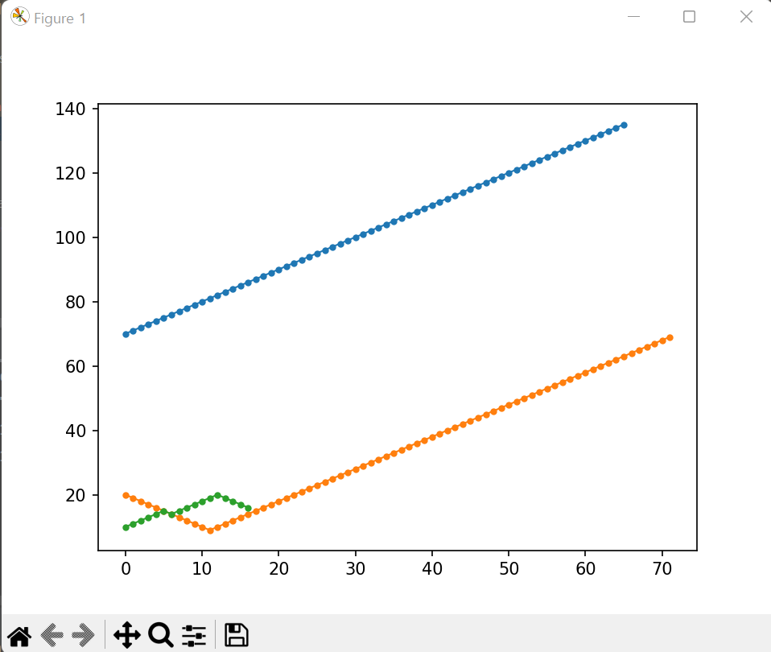
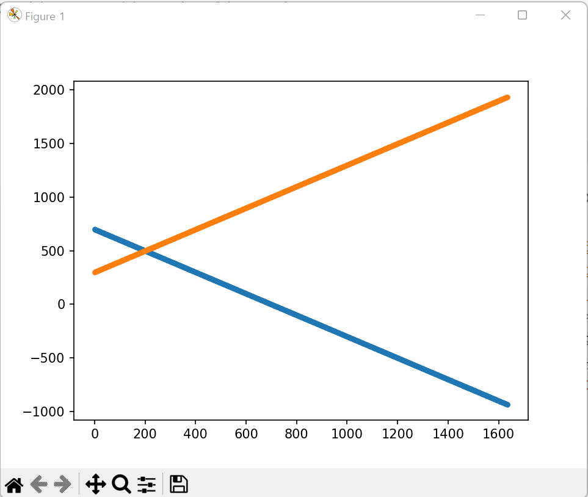

<h1>게임이론을 생태 군집에 적용한 프로젝트</h1>
 

**개요**

생명체는 이기적이다. <i>토마스 홉스가</i> <<리바이어던>> 이라는 저서에서 밝혔 듯 
인간은 만인의 만인에 대한 투쟁을 하는 존재라는 것이다. 

 <= 옆은 토마스 홉스의 사진이다.

그런데 이상한 점이 있다. 이렇게 이기적이고 전쟁같은 인간 세계에서 인간들은 왜 협동을 하는가? 인간은 왜 서로를 믿지 못할 만한 상황에서 협업을 하는가? 이에 대한 자세한 이론은 <<이기적 유전자>>(리처드 도킨스 저)에서 자세히 설명되어 있다. 그리고 이번 프로젝트는 왜 이러한 상황이 일어나는지에 대해서 시뮬레이션을 해보고 결과를 분석하는 것을 목표로 한다.

 
 
1. 필요한 개념 
필드 위에 수많은 개체들이 있는데 그 개체들 중에 만나는 개체를 무조건 도와주는 개체를 선심파(Friendly)라 하자. 그리고 만나면 무조건적으로 배신하는 개체들을 사기꾼 파(Bad)라 하자.
마지막으로 이게 가장 중요한 데 선심파에게는 도움을 주고 사기꾼 파에게는 응징하는 개체들을 Nice파라 하자.  
2. 구현 알고리즘  
좌표평면에 1과 0사이의 값을 각각 x좌표, y좌표로 가진 임의의 점을 무작위로 생성한다. 
 그리고 그 점 들이 0.05보다 가까운 거리에 있으면 조건문이 실행된다. Nice파가 선심파를 만나면 둘 다 개체 수가 1씩 늘어난다. 그리고 선심파가 사기꾼파를 만나면 사기꾼파는 1개체가 늘어나고 선심파는 1개체가 줄어든다.
 마지막으로 Nice파가 사기꾼 파를 만나면 사기꾼 파 개체가 1개 줄어든다.

1. 무작위로 개체생성
2. Nice + Friendly = Nice +1, Friendly +1
3. Bad + Friendly = Bad + 1, Friendly -1 
4. Nice + Bad  = Bad -1
5. 개체 수 그래프로 시각화 

4.사용한 라이브러리
1. math : 거리를 구하는 norm 함수에서 제곱근 값을 구하기 위해 사용
2. random : 처음에 무작위로 개체 값을 구하기  위해 사용
3. numpy : 배열 요소 연산을 위해 사용
4. matplotlib.pyplot : 그래프를 이용한 시각화를 위해 사용

5.결과  
  
결론적으로 결국 사기꾼 파는 계속 감소하다가 나머지 부류의 개체들과 함께 평형 상태를 이루게 된다. 그런데 Nice파가 없으면 어떻게 될까?  
 
 
위의 사례와 같이 사기꾼파의 개체수가 대다수를 차지하게 되는데 이러면 서로 도움을 주지 않으므로 그 개체는 멸종하게 된다.
###그래서 협력은 장기적인 관점으로 볼 때 의미가 있다. 